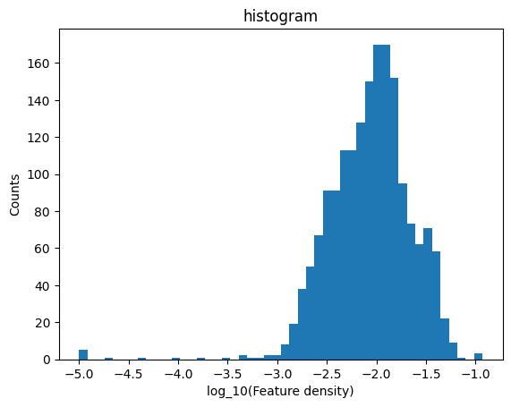
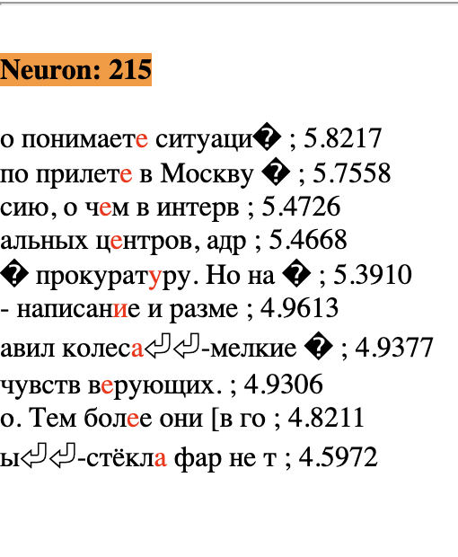
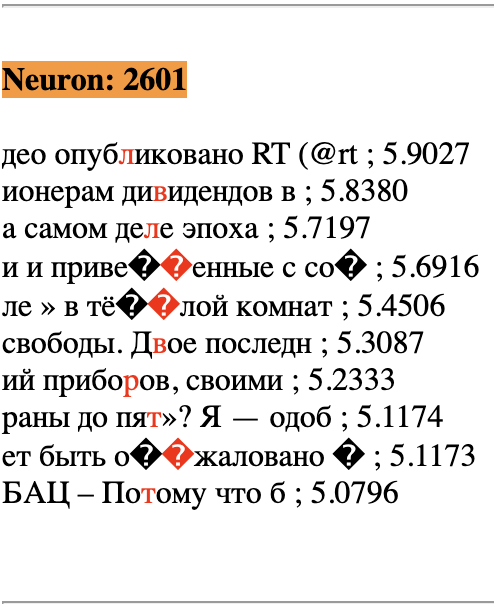

# Towards Monosemanticity

This repository reproduces results of [Anthropic's Monosemanticity paper](https://transformer-circuits.pub/2023/monosemantic-features/). It is still a work in progress, but I am making it public to invite feedback and comments. Please feel free to share your feedback. Thank you!

At the current stage, one can train a sparse autoencoder and analyze its features following the steps in the Reproduction section. A brief analysis of features has seemed promising. While I found most of the neurons to be dead (a few of the possible reasons for this are mentioned in the 'Possible Improvements' section below), I found ~1750 of 4096 neurons to be in the high density cluster.

<div align="center">
    
</div>

These neurons and their top 10 activation values along with tokens and contexts are given in [high_density_neurons.html](https://shehper.github.io/monosemantic/autoencoder/out_autoencoder/1704783101.13-autoencoder-openwebtext/high_density_neurons.html). I inspected the first 20 features manually, out of which I could interpret 19. I have written the common theme shared by top 10 activations for these 19 neurons in the HTML file. I also discovered more than 650 single-token features with the help of a Python function. (You may CTRL+F/CMD+F "single-token" on the HTML page to see them.) Some of these may be token-in-context features, but I have not checked that for individual neurons. 

An interesting example is of the pair of neurons # 215 and # 2601. Both of these neurons fire on Cyrilic script, but one of them fires on vowels (е, у, и, а) and the other one fires on consonants (л, в, р, т). 

<p align="middle">
   
   
</p>


The loss curves and feature density histograms for the best training run so far are available on this [Weights and Biases page](https://wandb.ai/shehper/sparse-autoencoder-openwebtext-public).

## Reproduction

### Step 0: Make a virtual environment and install packages

Clone the repository and change the directory.
```
https://github.com/shehper/monosemantic.git && cd monosemantic
```

Make a new virtual environment, and activate it.
```
python -m venv ./env
source ./env/bin/activate
```

Install packages from requirements.txt.
```
pip install -r requirements.txt
```

### Step 1: Train a one-layer transformer model

I used [nanoGPT](https://github.com/karpathy/nanoGPT) to train a one-layer transformer. The required code is in the 'transformer' folder. 

First, move to 'transformer' subdirectory.
```
cd transformer 
```

Next, prepare the OpenWebText dataset:

```
python data/openwebtext/prepare.py 
```

Finally, train the 1-layer transformer model:
```
python train.py config/train_gpt2.py --wandb_project=monosemantic --n_layer=1 --n_embd=128 --n_head=4 --max_iters=200000 --lr_decay_iters=200000
```

I trained the model for only 200000 iterations in order to match the number of training epochs with Anthropic's paper. 
This run takes ~3 days on one A100 GPU and achieves a validation loss of 4.609.

### Step 2: Generate training data for AutoEncoder

Now move to the autoencoder subdirectory. 
```
cd ../autoencoder 
```

First, generate the training data for the autoencoder. 
```
python generate_mlp_data.py
```
By default, this computes MLP activations on 4 million contexts from the (OpenWebText) dataset, samples these activation vectors from 200 tokens in each context, and randomly shuffles them before saving the entire dataset in n_files=20 files in 'sae_data' subfolder. I used a high-RAM node with 1TB RAM for this step, and it took about ~12 hours to complete.

Note that I saved it in 20 files because the node used for training the autoencoder in Step 3 did not have high amounts of RAM available. Therefore, during training, only 1/20th of the dataset could be loaded at a time. By default, all MLP activations are saved in float16 data type, so as to use the storage space in favor of collecting twice as many examples. The dataset takes around 770GB of storage space. If more storage space is available, one may increase the number of contexts through '--total_contexts' or save the data in float32 through '--convert_to_f16=False' flag. 

### Step 2a: Pick a subset of data for Neuron Resampling 

Anthropic used a random subset of 819200 activation vectors to resample neurons four times during training. As the node that I used for training (in Step 3) did not have high enough RAM so that I could load the entire training data of the AutoEncoder and select 819200 examples at the time of resampling, I used a high-RAM (> 1TB) node to pre-select 4*819200 examples and saved it in a separate file 'data_for_resampling_neurons.pt'. 

This may be done as follows. 
```
python select_resampling_data.py 
```

If you have high-RAM available on your GPU node, you may skip this step and sample the subset randomly at the time of neuron resampling.

### Step 3: Train a Sparse AutoEncoder model

Next, you may train the sparse autoencoder model as follows. 
```
python train.py --l1_coeff=3e-7 
```

I tried a few different values of the L1-coefficient and learning rate and noticed that the best trade-off between feature activation sparsity (=L0-norm) and reconstructed NLL score occured around l1-coeff=3e-7 and learning_rate=3e-4. This L1 coefficient is much smaller than the values of L1-coefficient used in Anthropic's paper. I do not know why this is the case. 


## Analysis of Results
During training, I logged various metrics including feature density histograms. They are available on this [Weights & Biases project](https://wandb.ai/shehper/sparse-autoencoder-openwebtext-public). The spikes in various loss curves appear at the training step of neuron resampling, as one would expect. 

It is mentioned in the Anthropic paper that they performed manual inspection of features during training. I did not perform this manual inspection *during* training but I did perform it after training finished to compare different models. 

For this step, I used top_activations.py as
```
python top_activations.py --autoencoder_subdir=/subdirectory/of/out_autoencoder/containing_model_ckpt --eval_contexts=20000 --length_context_on_each_side=10 --k=10 --publish_html=True
```

where /subdirectory/of/out_autoencoder/containing_model_ckpt is the name of the subdirectory of 'out_autencoder' folder containing the model checkpoint. This evaluates the model on 20000 contexts from the OpenWebText dataset. The output is saved as a dictionary of k=10 top activations for each autoencoder neuron. If we pass publish_html=True, it also saves the top 10 activations and the associated tokens and contexts for each neuron in the form of an HTML file in the same subdirectory.

For example, please see the HTML files [high_density_neurons.html](https://shehper.github.io/monosemantic/autoencoder/out_autoencoder/1704783101.13-autoencoder-openwebtext/high_density_neurons.html) and [ultra_low_density_neurons.html](https://shehper.github.io/monosemantic/autoencoder/out_autoencoder/1704783101.13-autoencoder-openwebtext/ultra_low_density_neurons.html) for the model with l1_coeff=3e-7, learning_rate=3e-4, and loss curves as in the afore-mentioned [Weights & Biases page](https://wandb.ai/shehper/sparse-autoencoder-openwebtext-public/runs/rajo0rsx?workspace=user-).


## Comments
### Preliminary observations
1. I found the algorithm suggested by Anthropic for neuron resampling to be extremely useful. With all of the other hyperparameters fixed (in particular, l1_coeff=3e-7, learning_rate=3e-4), I found that only ~200 neurons were alive without any neuron resampling, ~350 neurons were alive with a naive neuron resampling procedure (i.e. I re-initialized the weights of dead neurons using the PyTorch default Kaiming Uniform initialization), and 1700+ neurons were alive with Anthropic's neuron resampling procedure. 

2. High density neurons as seen in [high_density_neurons.html](https://shehper.github.io/monosemantic/autoencoder/out_autoencoder/1704783101.13-autoencoder-openwebtext/high_density_neurons.html) were quite interpretable. I studied the first twenty neurons in this file, and wrote down the common theme about the context in which these neurons seem to fire. Some of the ultra-low density neurons were also interpretable. (See [ultra_low_density_features.html](https://shehper.github.io/monosemantic/autoencoder/out_autoencoder/1704783101.13-autoencoder-openwebtext/ultra_low_density_neurons.html).) Perhaps, this is because my cutoff (1e-3 in the feature density histogram shown above) for separating high vs ultra-low density was not very precise. 

3. Almost 1/3rd of the ~1700 of neurons in high-density cluster were single-token features. (You may CTRL+F/CMD+F "single-token" in [high_density_neurons.html](https://shehper.github.io/monosemantic/autoencoder/out_autoencoder/1704783101.13-autoencoder-openwebtext/high_density_neurons.html) to look at these single-token features.)

4. When sorted by highest activation value, several of the top neurons seemed to single-token features. 

5. OpenWebText dataset is mostly monolingual, (I have not computed the exact percentage of English tokens in it yet) but the autoencoder learns features on texts of other languages. For example, the following neurons fire on specific languages or scripts. 3656: Spanish, 1305: Scandinavian, 77: South Slavic languages, 1682: Greek script, and 2601 and 215: Cyrilic. 

6. Quite interestingly, neuron # 215 seems to fire on Cyrilic vowels е, у, и, а, while neuron # 2601 seems to be active on Cyrilic consonants л, р, в, т.  

7. I see several � tokens in top activations of neurons. I don't know what these tokens mean, but perhaps this indicates that the OpenWebText contains some characters that BytePairEncoding does not encode. I intend to investigate this further.

### Possible improvements
1. **Data type of training data.** I saved MLP activations in float16 instead of float32 in order to save twice the number of examples in the same storage space at the cost of precision in each value. 
2. **Size of training data.** I used only 800M activation vectors; in contrast, Anthropic used 8B activation vectors. I made this choice and the previous choice because of storage constraints, though I hope to be able to obtain more storage soon.  
3. **Dead and ultra-low density neurons.** Out of 4096 neurons, I found around 2324 to be dead, and only around 17 to be in the ultra-low density cluster. I expect that with a combination of more training data (as I trained on only 1/10th of the number of training examples used by Anthropic), float32 data type and more hyperparameter-tuning, the number of dead neurons will decrease significantly and the number of ultra-low density neurons will increase.
4. **Number of evaluation tokens**. I evaluated my AutoEncoder on only 2e5 tokens while Anthropic evaluated their autoencoder on 1e7 tokens. Perhaps, by increasing the number of evaluation tokens, I will see more ultra-low density neurons and less dead neurons.
5. **A more complete analysis of features**. While the top 10 activations of most features seem to show clear patterns about contexts where these features are active, a more detailed analysis as done by Anthropic in their sections on [Detailed Analysis of Individual Features](https://transformer-circuits.pub/2023/monosemantic-features/index.html#feature-analysis) and [Global Analysis](https://transformer-circuits.pub/2023/monosemantic-features/index.html#global-analysis) needs to be done. 
6. **Feature ablations**. I must ablate features to see their causal effect on next-token-prediction. 

### Some curiosities
1. *L1-coefficient.* I do not know why the L1-coefficient for my training runs was three-to-four orders of magnitude smaller than the values used by Anthropic. (I had 3e-7, while they had values of the order of 1e-3 or 1e-4.)

2. *GeLU vs ReLU activations.* nanoGPT uses GeLU activations in its MLP layer. In contrast, Anthropic used ReLU activations in its MLP layer. I wonder if this small but subtle difference has a significant effect on the kind of features learned by the sparse autoencoder.


