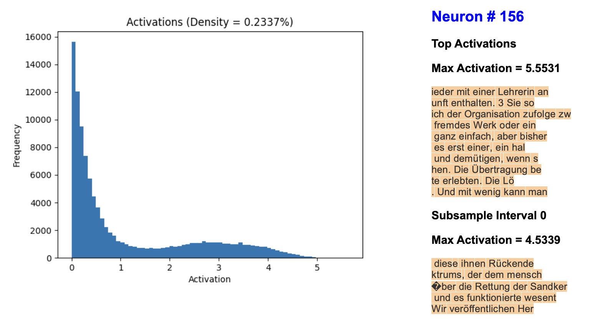
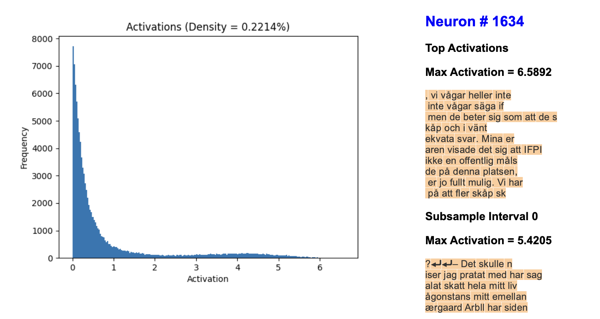

# Towards Monosemanticity

This repository reproduces results of [Anthropic's Sparse Dictionary Learning paper](https://transformer-circuits.pub/2023/monosemantic-features/). The codebase is quite rough, but the results are excellent. See the [feature interface](https://shehper.github.io/feature-interface/) to browse through the features learned by the sparse autoencoder.  There are improvements to be made (see the [TODOs](#todos) section below), and I will work on them intermittently as I juggle things in life :)

I trained a 1-layer transformer model from scratch using [nanoGPT](https://github.com/karpathy/nanoGPT) with $d_{\text{model}} = 128$. Then, I trained a sparse autoencoder with $4096$ features on its MLP activations as in [Anthropic's paper](https://transformer-circuits.pub/2023/monosemantic-features/). 93% of the autoencoder neurons were alive, only 5% of which were of ultra-low density. There are several interesting features. For example,

- [A feature for French](https://shehper.github.io/feature-interface/?page=2011)
- [A feature for German](https://shehper.github.io/feature-interface/?page=156)
- [A feature for Scandinavian languages](https://shehper.github.io/feature-interface/?page=1634)

  
   
  

along with many others:

- [A feature for Japanese](https://shehper.github.io/feature-interface/?page=1989)
- [A feature for Hebrew](https://shehper.github.io/feature-interface/?page=2026)
- [A feature for Cyrilic vowels](https://shehper.github.io/feature-interface/?page=3987)
- [A feature for token "at" in words like "Croatian", "Scat", "Hayat", etc](https://shehper.github.io/feature-interface/?page=1662)
- [A single token feature for "much"](https://shehper.github.io/feature-interface/?page=2760)
- [A feature for sports leagues: NHL, NBA, etc](https://shehper.github.io/feature-interface/?page=379)
- [A feature for Gregorian calendar dates](https://shehper.github.io/feature-interface/?page=344)
- [A feature for "when"](https://shehper.github.io/feature-interface/?page=2022):
      - this feature particularly stands out because of the size of the mode around large activation values. 
- [A feature for "&"](https://shehper.github.io/feature-interface/?page=1916)
- [A feature for ")"](https://shehper.github.io/feature-interface/?page=1917)
- [A feature for "v" in URLs like "com/watch?v=SiN8](https://shehper.github.io/feature-interface/?page=27)
- [A feature for programming code](https://shehper.github.io/feature-interface/?page=45)
- [A feature for Donald Trump](https://shehper.github.io/feature-interface/?page=292)
- [A feature for LaTeX](https://shehper.github.io/feature-interface/?page=538)

<!-- - [Bigram feature 1?](https://shehper.github.io/feature-interface/?page=446)
[Bigram feature 2?](https://shehper.github.io/feature-interface/?page=482) -->

<!-- - [A feature for some negative words/news](https://shehper.github.io/feature-interface/?page=218) -->

<!-- ### Training Details

I used the "OpenWebText" dataset to train the transformer model and to create the visualization. I trained the autoencoder on  -->

<!-- OpenWebText dataset is mostly monolingual.
I see several � tokens in top activations of neurons. I don't know what these tokens mean, but perhaps this indicates that the OpenWebText contains some characters that BytePairEncoding does not encode. I intend to investigate this further. -->

<!-- The loss curves and feature density histograms for the best training run so far are available on this [Weights and Biases page](https://wandb.ai/shehper/sparse-autoencoder-openwebtext-public).

I did not implement any changes suggested by Anthropic in their January and February updates. 

### TODOs
- Incorporate the effects of feature ablations into the feature interface. 
- Implement an interface to see "Feature Activations on Example Texts" as done by Anthropic [here](https://transformer-circuits.pub/2023/monosemantic-features/vis/a1-math.html).
- Make the codebase easy to import and use with other 

5. **A more complete analysis of features**. While the top 10 activations of most features seem to show clear patterns about contexts where these features are active, a more detailed analysis as done by Anthropic in their sections on [Detailed Analysis of Individual Features](https://transformer-circuits.pub/2023/monosemantic-features/index.html#feature-analysis) and [Global Analysis](https://transformer-circuits.pub/2023/monosemantic-features/index.html#global-analysis) needs to be done.  -->

